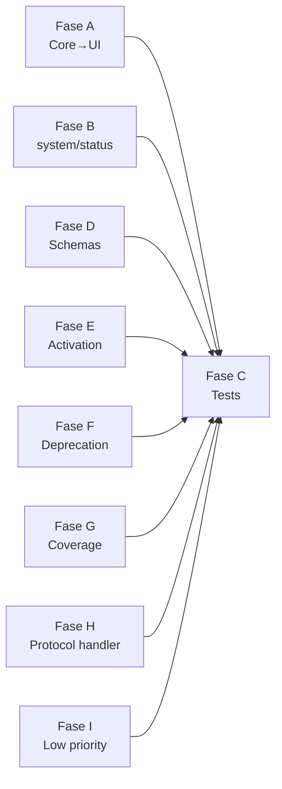

# Roadmap v0.6.0 — Reorganización estructural

> Plan de fases para abordar los 14 hallazgos estructurales detectados en la auditoría `Docs/Issues/v0.5.5/1-Issuesfound.md`.
> Auditoría: 2026-05-15

---

## Priorización

| #   | Fase | Problema                                                           | Severidad | Archivo                                                                              |
| --- | ---- | ------------------------------------------------------------------ | --------- | ------------------------------------------------------------------------------------ |
| 1   | A    | Core importa desde UI (`runSuggest.ts` → `suggestionNotification`) | 🔴 HIGH   | [`./01-core-ui-dependency.md`](./01-core-ui-dependency.md) ✅                        |
| 2 | B | `system/status/` es lógica de dominio, no infraestructura | 🔴 HIGH | [`./02-system-status-relocation.md`](./02-system-status-relocation.md) ✅ |
| 3 | C | Tests co-locados junto al source (no espejo) | 🔴 HIGH | [`./03-test-restructure.md`](./03-test-restructure.md) ✅ |
| 4   | D    | Schemas webview en `system/contracts/` en vez de `api/`            | 🟡 MEDIUM | [`./04-schema-ownership.md`](./04-schema-ownership.md) ✅                               |
| 5   | E    | Eliminar sistema de Project Memory (se reconstruirá desde 0)                       | 🟡 MEDIUM | [`./05-activation-relocation.md`](./05-activation-relocation.md) ✅                     |
| 6   | F    | Código deprecado no aislado                                        | 🟡 MEDIUM | [`./06-deprecation-cleanup.md`](./06-deprecation-cleanup.md) ✅                         |
| 7   | G    | Test referenciado inexistente + módulos sin cobertura              | 🟡 MEDIUM | [`./07-missing-references-and-coverage.md`](./07-missing-references-and-coverage.md) ✅ |
| 8   | H    | Lógica de negocio en handler de protocolo                          | 🟡 MEDIUM | [`./08-protocol-handler-cleanup.md`](./08-protocol-handler-cleanup.md) ✅               |
| 9   | I    | Low priority: barrels, exports duales, dev tools, nesting          | 🟢 LOW    | [`./09-low-priority-cleanup.md`](./09-low-priority-cleanup.md) ✅                       |

---

## Dependencias entre fases

Todas las fases A–I son **ortogonales** (no comparten archivos), por lo que pueden ejecutarse en cualquier orden SECUENCIAL o EN PARALELO. La **Fase C** (co-locar tests) debe ser la **última**, ya que requiere que el código fuente esté estable para mover los tests junto a sus fuentes.

---

## Orden de ejecución recomendado

1. **Fase A** (Core→UI) — el más riesgoso por violación de capas
2. **Fase B** (system/status) — el más voluminoso
3. **Fase D** (schemas) — mecánico, rápido
4. **Fase E** (activation) — mecánico, rápido
5. **Fase F** (deprecation) — mecánico, rápido
6. **Fase H** (protocol handler) — requiere extracción cuidadosa
7. **Fase G** (coverage) — añade tests, no modifica producción
8. **Fase I** (low priority) — cambios menores
9. **Fase C** (co-locar tests) — mover tests tras refactors, actualizar vitest config

---

## Bitácora

| Fecha      | Fase | Nota                                                                                                                                |
| ---------- | ---- | ----------------------------------------------------------------------------------------------------------------------------------- |
| 2026-05-15 | —    | Roadmap creado con 9 fases (A–I) para los 14 hallazgos estructurales                                                                |
| 2026-05-15 | A | **Fase A completa:** Core→UI dependency eliminada. `NotifyIssueCallback` inyectado en `GhostPromptSuggestDeps`. 282 tests en verde. |
| 2026-05-15 | B | **Fase B completa:** `system/status/` → `core/status/`. 7 imports actualizados, barrel actualizado. 282 tests en verde. |
| 2026-05-15 | C | **Fase C re-diseñada:** De "espejo" a "co-location". Tests viven junto al source que prueban. Ver `03-test-restructure.md`. |
| 2026-05-15 | C | **Fase C completa:** 48 tests co-locados en `src/`. `tests/` solo tiene `integration/` y `webview/`. 282 tests en verde. |
| 2026-05-15 | D | **Fase D completa:** `system/contracts/webviewMessageSchemas.ts` → `api/contracts/`. Imports actualizados. 282 tests en verde. |
| 2026-05-15 | E | **Fase E completa:** `src/core/memory/` eliminado (13 archivos). Config keys `projectMemory*` removidas de package.json. 257 tests en verde (47 files). |
| 2026-05-15 | F | **Fase F completa:** `SuggestionRequestGovernor` eliminado (2 archivos). `system/policies/` borrado. 250 tests en verde (46 files). |
| 2026-05-15 | G | **Fase G completa:** 4 tests nuevos creados (loading, Logger, outputChannel, collect). READMEs actualizados. 281 tests en verde (50 files). |
| 2026-05-15 | H | **Fase H completa:** Lógica Ollama extraída de `inboundHandlers.ts` → callback `onSettingChanged` inyectado desde `MiniInputViewProvider`. 286 tests (2 fallos pre-existentes en `ollamaApiClient`). |
| 2026-05-15 | I | **Fase I completa:** `core/contracts/` eliminado (tipos unificados en `core/types.ts`). `discoverCursorChatCommands` marcado como dev tool provisional. 286 tests en verde (50 files). |

---

## Referencias

- Auditoría completa: [`../1-Issuesfound.md`](../1-Issuesfound.md)
- Roadmap v0.6 existente: [`Docs/Plans/Roadmaps/v0.6/`](../../../Plans/Roadmaps/v0.6/)
- Convención de fases: [`Docs/Plans/Roadmaps/v0.6/Destinations/01-cursor-chat-destination.md`](../../../Plans/Roadmaps/v0.6/Destinations/01-cursor-chat-destination.md)
