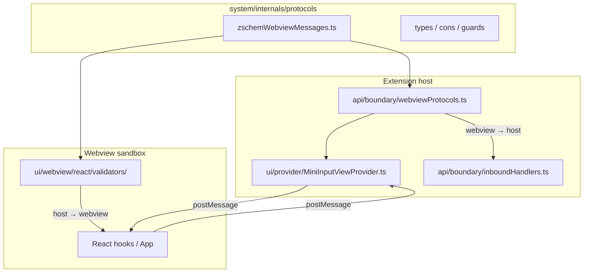

# FA–FE — Consolidación boundary + contratos webview (v0.6.2)

> **Objetivo:** Cerrar la deuda entre `api/boundary/` (canónico) y duplicados legacy (`api/protocols/`, parse en webview), dejando una sola línea clara host ↔ webview sobre `system/internals/protocols/`.
>
> **Versión objetivo:** `0.6.2` (`package.json`).
>
> **Fuera de alcance:** Nuevas tranches ESLint globales, extracción masiva fuera de `ui/` + `api/`, features de producto.

---

## Mapa de responsabilidades (referencia)

| Dirección | Schema Zod | Parser canónico | Logging en fallo |
| --------- | ---------- | --------------- | ---------------- |
| Webview → host | `webviewInboundMessageSchema` | `api/boundary/parseWebviewInboundMessage` | Sí |
| Host → webview | `webviewOutboundMessageSchema` | `api/boundary/parseWebviewOutboundMessage` (dev) | Sí |
| Host → webview (panel) | mismo | `ui/webview/.../parseWebviewInbound.ts` | No (sandbox) |

---

## Fase FA — Eliminar shims `api/protocols/`

> **Motivo:** QG introdujo `api/boundary/`; `src/api/protocols/` duplica archivos y confunde imports / documentación. No hay imports activos desde `src/` hacia `api/protocols/` (verificar con ripgrep antes de borrar).

| # | Tarea | Archivo / acción |
| - | ----- | ---------------- |
| A1 | Confirmar cero referencias en `src/`, `tests/`, `eslint`, `tsconfig` | `rg "api/protocols"` |
| A2 | Borrar carpeta `src/api/protocols/` (handlers, tests, mocks) | eliminar árbol |
| A3 | Asegurar exports públicos solo desde `src/api/index.ts` → `boundary/` | `api/index.ts` |
| A4 | Mover tests si alguno quedó huérfano bajo `protocols/` | → `api/boundary/*.test.ts` |

**Criterio de hecho:** `src/api/protocols/` no existe. `npm run check` verde. `api/index.ts` exporta `parseWebview*` desde `boundary/`.

---

## Fase FB — Paridad parse webview (sin fusionar capas)

> **Motivo:** `parseWebviewInbound.ts` en el webview y `webviewProtocols.ts` en el host usan el **mismo** schema pero implementaciones separadas (correcto: el webview no puede importar logging). El riesgo es **deriva** silenciosa entre ambos.

| # | Tarea | Archivo | Estado |
| - | ----- | ------- | ------ |
| B1 | Documentar: inbound webview = `webviewOutboundMessageSchema` (host→panel) | `parseWebviewInbound.ts` | ✅ |
| B2 | Test de paridad webview + boundary sobre mismos fixtures | `parseWebviewInbound.test.ts`, `webviewProtocols.test.ts` | ✅ |
| B3 | Fixtures compartidos válidos/inválidos | `fixtures/webviewOutboundMessageFixtures.ts` | ✅ |
| B4 | Retorno `false` en JSDoc (no `undefined`) | `parseWebviewInbound.ts`, `useGhostPrompt.test.ts` | ✅ |

**Criterio de hecho:** Tests de paridad verdes. Un solo archivo de fixtures usado por host y webview. Sin import de `api/boundary` desde `ui/webview/`.

**No hacer:** Mover parsers a `protocols/` con logging (viola capa pura).

---

## Fase FC — Barrel tipos React (`types.ts`)

> **Motivo:** `ui/webview/react/types.ts` ya reexporta tipos desde `protocols/` (bien). Revisar que no queden tipos locales duplicados ni imports directos largos en componentes cuando el barrel basta.

| # | Tarea | Archivo | Estado |
| - | ----- | ------- | ------ |
| C1 | Inventariar imports profundos a `protocols/` en `ui/webview/react/` | grep / depcruise | ✅ |
| C2 | Tipos solo desde `./types` o `../types` (ya estaba en hooks/components) | — | ✅ |
| C3 | Constantes runtime vía `webviewProtocolConstants.ts` (no en `types.ts`) | `webviewProtocolConstants.ts` | ✅ |
| C4 | `InboundMessage` / `OutboundMessage` alias Zod; schemas en `webviewProtocolSchemas.ts` | `types.ts`, `parseWebviewInbound.ts` | ✅ |

**Criterio de hecho:** Menos rutas profundas repetidas; `types.ts` sigue siendo el único barrel de tipos del webview. 0 ciclos nuevos en `depcruise`.

---

## Fase FD — Documentación y referencias

| # | Tarea | Archivo | Estado |
| - | ----- | ------- | ------ |
| D1 | Actualizar `Docs/Owners.md` y `Docs/ARCHITECTURE.md`: solo `api/boundary/`, no `api/protocols/` | docs | ✅ |
| D2 | Actualizar `NamingConventions.md` (parsers con log → `api/boundary/`) | ExtensionArchitecture | ✅ |
| D3 | Entrada `CHANGELOG.md` sección 0.6.2 | changelog | ✅ |
| D4 | Enlazar este roadmap desde `v0.6.1/README.md` como continuación | README v0.6.1 | ✅ (ya enlazado) |

**Criterio de hecho:** `rg "api/protocols"` en `Docs/` solo hits históricos acotados o ninguno en rutas activas.

---

## Fase FE — Cierre release 0.6.2

| # | Tarea |
| - | ----- |
| E1 | `package.json` / tag versión `0.6.2` (ya bump local si aplica) |
| E2 | `npm run vsix` + smoke: activación, panel, log, un mensaje `init` |
| E3 | Actualizar tabla **Estado** en [`README.md`](./README.md) (FA–FE completadas) |
| E4 | PR / merge `feature/react-vite-tailwind-webview` → `main` según flujo del repo |

**Criterio de hecho:** VSIX instalable; bitácora del roadmap al día.

---

## Orden de ejecución recomendado

1. **FA** (rápido, reduce ruido mental y lint paths muertos).
2. **FB** (mayor valor: evita regresiones de contrato).
3. **FC** (opcional / incremental por carpeta).
4. **FD** + **FE** (cierre).

Paralelizable: FC puede hacerse por PRs pequeños mientras FB avanza.

---

## Registro de ejecución

| Fecha | Fase | Resultado |
| ----- | ---- | --------- |
| 2026-05-18 | — | Plan v0.6.2 creado (FA–FE). Pendiente de inicio. |
| 2026-05-18 | FA | Eliminado `src/api/protocols/` y duplicado `api/settings/applyWebviewUpdate*`. `npm run check` verde. |
| 2026-05-18 | FB | Fixtures `webviewOutboundMessageFixtures.ts`, tests paridad webview + boundary. JSDoc `parseWebviewInbound`. |
| 2026-05-18 | FC | Barrels `webviewProtocolConstants.ts` y `webviewProtocolSchemas.ts`; sin imports `../../../../protocols` en hooks. |
| 2026-05-18 | FD | `Owners`, `ARCHITECTURE`, `NamingConventions`, `CHANGELOG` 0.6.2; ruta activa `api/boundary` en `Cursor.md`. |

## Bitácora

| Fecha | Nota |
| ----- | ---- |
| 2026-05-18 | Roadmap abierto tras lint verde y bump 0.6.2. Sin fases QA/QG: numeración FA+. |
