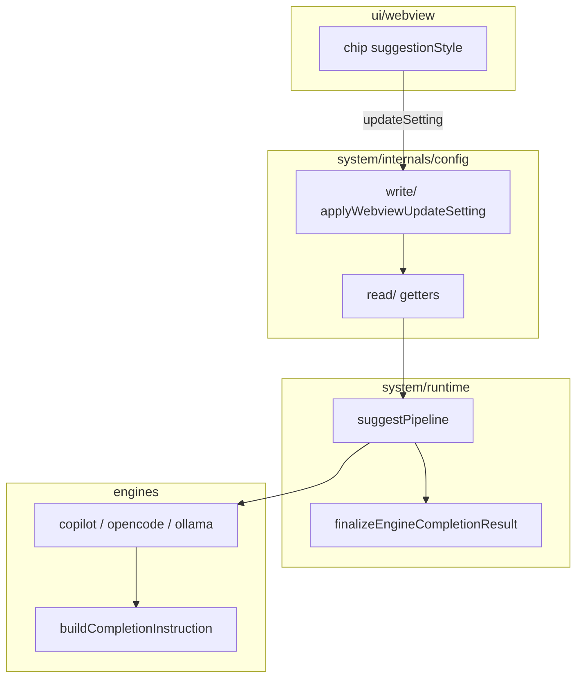

# FK–FP — Runtime + config canónico del pipeline suggest (v0.6.2)

> **Objetivo:** Una sola línea clara desde `ghostPrompt.*` (lectura/escritura en `system/internals/config/`) hasta el LM (`engines/`), con `system/runtime/` organizado por dominio y el estilo de pre-suggestion (**breve / normal / extenso**) conectado al flujo canónico.
>
> **Versión objetivo:** `0.6.2` (`package.json`).
>
> **Fuera de alcance:** Nuevos motores LM, rediseño de toolbar, extracción masiva de `engines/config/completionSources.ts` (sigue siendo política de **qué motor** corre, no settings de producto del pipeline).

**Relación con otros planes v0.6.2:**

| Plan | Foco |
| ---- | ---- |
| [01-consolidation-boundary-webview.md](./01-consolidation-boundary-webview.md) | Contratos host ↔ webview (`api/boundary/`, barrels) |
| [02-chat-webview-presuggestions.md](./02-chat-webview-presuggestions.md) | Pre-suggestions en UI (capture, overlay, UX chat) |
| **03 (este doc)** | Pipeline host: config → runtime → engines |

---

## Diagnóstico inicial

### Flujo canónico deseado vs actual



| Área | Hallazgo | Archivos principales |
| ---- | -------- | -------------------- |
| **Estilo (breve/normal/extenso)** | Toolbar + `updateSetting` + `getGhostPromptSuggestionStyle()` funcionan; `suggestRuntime` pasa `style` a motores pero **Copilot/Ollama/OpenCode lo ignoran** (`style: _style`). `buildCompletionInstruction` no recibe estilo. | `buildCompletionInstruction.ts`, `*CompletionEngine.ts`, `suggestRuntime.ts` |
| **maxSuggestionChars** | Getter en `config/read`; `finalizeEngineCompletionResult` en **passthrough** diagnóstico (sin acotación ni rechazo LM). | `finalizeEngineCompletionResult.ts`, `workspaceConfigGetters.ts` |
| **minCharsForSuggestion** | Definido en `package.json` (default 6); pipeline usa `DEFAULT_MIN_SUGGEST_INPUT_CHARS = 3` de `consPipelineDefaults`, **sin leer** `ghostPrompt.minCharsForSuggestion`. | `suggestRuntime.ts`, `consPipelineDefaults.ts` |
| **suggestionDebounceMs** | Leído inline en `settingsPostMessage` con `vscode.workspace`, no en `config/read/`. | `api/settings/settingsPostMessage.ts` |
| **Duplicados config** | `api/getters/workspaceGetters.ts` duplica `config/read/workspaceConfigGetters.ts` y **no tiene importadores**; `api/index.ts` ya reexporta desde `config/read`. | `api/getters/`, `api/index.ts` |
| **runtime plano** | Mezcla pipeline suggest, coordinator, finalize, estado de proveedores y utilidades en una sola carpeta. | `system/runtime/*.ts` |
| **completionSources** | Correctamente en `engines/config/` (fuentes LM habilitadas); no confundir con settings del pipeline suggest. | `engines/config/completionSources.ts` |

### Tabla clave → lector → consumidor (artefacto FK)

| Clave `ghostPrompt.*` | Lector canónico (objetivo) | Consumidor | ¿Conectado? |
| --------------------- | -------------------------- | ---------- | ----------- |
| `suggestionStyle` | `getGhostPromptSuggestionStyle()` | `suggestRuntime` → motores → instruction | Parcial (log sí, LM no) |
| `maxSuggestionChars` | `getGhostPromptMaxSuggestionChars()` | `finalizeEngineCompletionResult` | No (passthrough) |
| `minCharsForSuggestion` | `getGhostPromptMinCharsForSuggestion()` (nuevo) | `suggestRuntime` (umbral too-short) | No |
| `suggestionDebounceMs` | `getGhostPromptSuggestionDebounceMs()` (nuevo) | `settingsPostMessage` → webview | Parcial (inline vscode) |
| `suggestionModelPolicy` | `readGhostPromptSuggestionModelPolicy()` | `suggestRuntime`, catálogos | Sí |
| `selectedModelId` | `getGhostPromptSelectedModelId()` | routing + suggest | Sí |
| `enabledCompletionSources` | `engines/config/completionSources` | routing | Sí (fuera de `config/read` a propósito) |

---

## Decisiones de diseño (acordadas)

1. **Estilo → prompt + longitud (opción C):** variantes en `buildCompletionInstruction` **y** tope efectivo por estilo vía `finalizeEngineCompletionResult` / caps derivados de `maxSuggestionChars`.
2. **`engines/config/completionSources`:** se mantiene en `engines/`; solo documentar en README de `config/` que no es duplicación pendiente.
3. **Passthrough diagnóstico:** se revierte en fase **FN**, después de **FM** (estilo visible en comportamiento).
4. **Orden:** **FK → FL → FM → FN → FO → FP** (reorganización mecánica de `runtime/` al final).
5. **Release:** plan 3 forma parte de **v0.6.2** (puede solaparse con cierre FI/FJ del plan 02).

### Caps sugeridos por estilo (borrador FM — ajustar en implementación)

| `SuggestionStyle` | UI (toolbar) | Factor sobre `maxSuggestionChars` | Notas instruction |
| ----------------- | ------------ | --------------------------------- | ----------------- |
| `concise` | Breve | ~0.45 (mín. `MIN_MAX_SUGGESTION_CHARS`) | Continuación corta, una frase |
| `balanced` | Normal | 1.0 (valor configurado) | Comportamiento actual deseado |
| `detailed` | Extenso | ~1.75 (máx. `MAX_MAX_SUGGESTION_CHARS`) | Permite varias frases si encaja |

Los factores viven en `consPipelineDefaults` o `protocols/types` como constantes nombradas, no números mágicos en motores.

---

## Fase FK — Auditoría y limpieza de config

> **Motivo:** Evitar regresiones como `suggestionStyle` “conectado” solo en UI. Un solo dueño de lectura `ghostPrompt.*` para el pipeline.

| # | Tarea | Archivo / acción |
| - | ----- | ---------------- |
| K1 | Eliminar `api/getters/workspaceGetters.ts` (o dejar shim de una línea que reexporte `config/read` si algún import externo aparece) | `api/getters/` |
| K2 | Añadir `getGhostPromptMinCharsForSuggestion()` con clamp alineado a `package.json` | `config/read/workspaceConfigGetters.ts` |
| K3 | Añadir `getGhostPromptSuggestionDebounceMs()` con clamp (`consPipelineDefaults`) | `config/read/workspaceConfigGetters.ts` |
| K4 | Usar getters en `suggestRuntime` (min chars) y `settingsPostMessage` (debounce) | `suggestRuntime.ts`, `settingsPostMessage.ts` |
| K5 | Documentar tabla clave→lector→consumidor en `config/README.md` | `system/internals/config/README.md` |
| K6 | Test: min chars desde config afecta `too-short`; debounce en envelope settings | `suggestRuntime.test.ts`, tests settings |

**Criterio de hecho:** Ningún getter duplicado en `api/getters/`; `minCharsForSuggestion` y `suggestionDebounceMs` leen solo desde `config/read/`.

---

## Fase FL — Contrato “pipeline settings”

> **Motivo:** Tipos y parsers compartidos para settings que afectan al LM, sin `vscode` en `protocols/`.

| # | Tarea | Archivo / acción |
| - | ----- | ---------------- |
| L1 | Tipo/documento `GhostPromptPipelineSettings` (style, maxChars, minChars, debounce) — puede ser interface en `protocols/types` o snapshot en `config/read` | `protocols/types/` o `config/read/pipelineSettings.ts` |
| L2 | Guard/parser `parseSuggestionStyle(raw): SuggestionStyle` (único lugar para `concise \| balanced \| detailed`) | `protocols/guards/` o `config/read/parseSuggestionStyle.ts` |
| L3 | Refactor getters para usar el parser (eliminar `if` duplicados) | `workspaceConfigGetters.ts` |
| L4 | Constantes de factor por estilo (`STYLE_MAX_CHARS_FACTOR` o caps absolutos) | `consPipelineDefaults.ts` |
| L5 | Función pura `resolveEffectiveMaxSuggestionChars(style, configuredMax): number` | `protocols/` o `engines/completion/` |
| L6 | Tests unitarios del resolver y del parser de estilo | tests nuevos |

**Criterio de hecho:** Cambiar enum en `package.json` solo requiere tocar schema Zod + parser + `cons*`; motores no repiten validación de string.

---

## Fase FM — Conectar `suggestionStyle` al flujo canónico

> **Motivo:** El chip Breve/Normal/Extenso debe cambiar el comportamiento del LM, no solo la etiqueta del toolbar.

| # | Tarea | Archivo / acción |
| - | ----- | ---------------- |
| M1 | `buildCompletionInstruction(userText, { style })` con ramas concise/balanced/detailed | `engines/completion/buildCompletionInstruction.ts` |
| M2 | Actualizar Copilot, Ollama, OpenCode para pasar `options.style` a la instruction | `*CompletionEngine.ts`, `opencodeCompletionFetch.ts` |
| M3 | Usar `style` en logs de motores (quitar `_style` ignorado) | engines |
| M4 | `suggestRuntime`: opcionalmente pasar `resolveEffectiveMaxSuggestionChars` a finalize (preparar FN) o aplicar cap intermedio si FN se retrasa | `suggestRuntime.ts` |
| M5 | Tests: misma entrada de usuario, distinto `style` → distinta instruction (snapshot de string) | `buildCompletionInstruction.test.ts`, engine tests |
| M6 | Smoke manual: cambiar chip y verificar en log `request-start` + longitud/tone distinto de suggestion | GhostPrompt Log |

**Criterio de hecho:** Con el mismo borrador, **Breve** produce instrucción y/o salida visiblemente más corta que **Extenso** (tests + smoke).

---

## Fase FN — Restaurar post-proceso del pipeline

> **Motivo:** Cerrar el modo passthrough diagnóstico (v0.6.2 overlay) y volver a acotación/rechazo alineados a producto.

| # | Tarea | Archivo / acción |
| - | ----- | ---------------- |
| N1 | Restaurar `boundSuggestionText` y `looksLikeCopilotRefusal` en `finalizeEngineCompletionResult` | `finalizeEngineCompletionResult.ts` |
| N2 | Aplicar `resolveEffectiveMaxSuggestionChars(style, max)` antes de `boundSuggestionText` | `finalizeEngineCompletionResult.ts`, `suggestRuntime.ts` |
| N3 | Revertir tests de passthrough a comportamiento de producto | `finalizeEngineCompletionResult.test.ts`, `suggestRuntime.test.ts` |
| N4 | Comentario en archivo: relación style ↔ max chars efectivos | `finalizeEngineCompletionResult.ts` |

**Criterio de hecho:** `ghostPrompt.maxSuggestionChars` y el chip de estilo afectan la suggestion mostrada; rechazos LM vuelven a `content-blocked` cuando aplique.

---

## Fase FO — Reorganizar `system/runtime/`

> **Motivo:** Navegación y ownership claro sin cambiar comportamiento (refactor mecánico).

Estructura objetivo:

```text
system/runtime/
├── suggest/
│   ├── suggestPipeline.ts              # rename desde suggestRuntime.ts
│   ├── suggestionRequestCoordinator.ts
│   ├── finalizeEngineCompletionResult.ts
│   └── lastEffectiveSuggestionModel.ts
├── providers/
│   ├── providerStatusManager.ts
│   └── createProviderErrorRecord.ts
├── testing/
│   └── resetHostRuntimeForTests.ts
├── simpleEventEmitter.ts
└── README.md
```

| # | Tarea | Archivo / acción |
| - | ----- | ---------------- |
| O1 | Mover ficheros a subcarpetas; barrel `system/runtime/index.ts` opcional | `system/runtime/` |
| O2 | Alias export `handleGhostPromptSuggest` / `runGhostPromptSuggestPipeline` sin romper imports | `suggest/suggestPipeline.ts` |
| O3 | Actualizar imports en `api/`, `ui/provider/`, tests | repo |
| O4 | Actualizar `system/runtime/README.md` y fila en `Docs/Owners.md` | docs |

**Criterio de hecho:** `npm run check` verde; ningún import roto; README refleja subcarpetas.

---

## Fase FP — Verificación y cierre documental

| # | Tarea |
| - | ----- |
| P1 | `npm run check` |
| P2 | Actualizar [`README.md`](./README.md) del roadmap v0.6.2 (fila FK–FP) |
| P3 | Entrada CHANGELOG v0.6.2 (config canónica + estilo conectado + runtime reorganizado) |
| P4 | Smoke: Settings VS Code `ghostPrompt.suggestionStyle` + chip toolbar + tres longitudes perceptibles |
| P5 | Smoke: `minCharsForSuggestion` y debounce desde Settings afectan comportamiento |

**Criterio de hecho:** Documentación al día; smoke sin “estilo fantasma” (UI cambia, LM igual).

---

## Orden recomendado

1. **FK** — limpieza y getters faltantes (rápido, bajo riesgo).
2. **FL** — contrato y caps por estilo (fundamento para FM/FN).
3. **FM** — impacto visible en producto.
4. **FN** — cerrar passthrough y límites.
5. **FO** — refactor mecánico de carpetas.
6. **FP** — verificación y CHANGELOG.

Puede ejecutarse en paralelo con **FI/FJ** del [plan 02](./02-chat-webview-presuggestions.md) si distintas personas o PRs; evitar tocar `PromptInput.tsx` y `finalize*` en la misma PR sin coordinación.

---

## Registro de ejecución

| Fecha | Fase | Resultado |
| ----- | ---- | --------- |
| 2026-05-19 | - | Plan creado tras auditoría config/runtime y desconexión `suggestionStyle` en motores. |
| 2026-05-19 | FK–FP | Implementado: getters config, estilo en instruction + caps, finalize restaurado, `runtime/suggest|providers|testing`, tests 349 OK. |
| 2026-05-19 | FO cleanup | Eliminados reexports duplicados en raíz de `runtime/`; imports actualizados a subcarpetas; README/Owners alineados. |

## Bitácora

| Fecha | Nota |
| ----- | ---- |
| 2026-05-19 | Diagnóstico: estilo solo en UI/log; `minChars` y debounce dispersos; `finalize` en passthrough; `api/getters/workspaceGetters` huérfano. Decisión: estilo = instruction + caps (opción C). |
