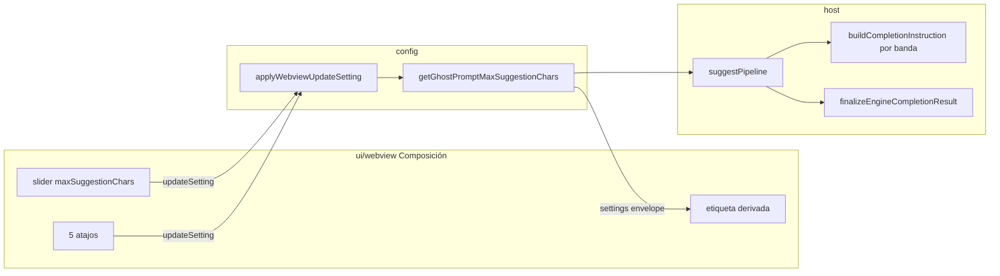

# FQ–FV — Longitud de pre-suggestion: slider + 5 atajos (v0.6.2)

> **Objetivo:** Sustituir el enum `ghostPrompt.suggestionStyle` (breve / normal / extenso) por **un solo control de producto**: `ghostPrompt.maxSuggestionChars`, ajustable con **slider** en el chip Composición y **5 atajos** (muy conciso → muy extenso). La etiqueta visible se **deriva** del valor; no se persiste un estilo aparte.
>
> **Versión objetivo:** `0.6.2` (`package.json`).
>
> **Fuera de alcance:** Nuevos motores LM, cambios en overlay ghost (plan 02), debounce/minChars (ya en plan 03).

**Relación con otros planes v0.6.2:**

| Plan | Foco |
| ---- | ---- |
| [01-consolidation-boundary-webview.md](./01-consolidation-boundary-webview.md) | Contratos host ↔ webview |
| [02-chat-webview-presuggestions.md](./02-chat-webview-presuggestions.md) | Pre-suggestions UI (capture, overlay) |
| [03-runtime-config-pipeline.md](./03-runtime-config-pipeline.md) | Config canónica + pipeline + `runtime/` reorganizado |
| **04 (este doc)** | Longitud: slider, atajos, eliminar `suggestionStyle` |

**Prerrequisito:** Plan 03 (FK–FP) completado — pipeline usa `finalize` y getters; este plan **elimina** la capa de factores por estilo del plan 03.

---

## Estado del plan (marcar al avanzar)

| Fase | Tema | Estado |
| ---- | ---- | ------ |
| **FQ** | Contrato, constantes y etiquetas derivadas | Completado |
| **FR** | Quitar `suggestionStyle` de `package.json` + migración lectura | Completado |
| **FS** | Host: pipeline e instruction por `maxSuggestionChars` | Completado |
| **FT** | Webview: slider + 5 atajos en Composición | Completado |
| **FU** | Limpieza código muerto (enum, factores, getters estilo) | Completado |
| **FV** | Verificación, docs, CHANGELOG, smoke | En curso — `npm run check` verde; smoke manual y docs raíz pendientes |

### Resumen ejecutivo (2026-05-19)

| Área | Estado |
| ---- | ------ |
| Código (`src/`) | **FQ–FU completado** — sin `SuggestionStyle` en runtime; solo `migrateGhostPromptSuggestionLength.ts` lee legacy |
| Tests automáticos | **347 tests OK** (`npm run check`) |
| CHANGELOG + plan README | Actualizados |
| Smoke manual (FV) | **Pendiente** — checklist § FV |
| Docs producto | **Completado** — `README.md` raíz y `protocols/README.md` alineados |

---

## Diagnóstico (por qué cambiar — histórico pre-implementación)

| Problema | Causa actual |
| -------- | ------------- |
| Normal y extenso se parecen | Dos perillas: `maxSuggestionChars` (180) × factor estilo (1.0 / 1.75) → 180 vs 315; LM acorta igual |
| Breve “funciona bien” pero no es ~25 chars | Factor `concise` 0.45 → **81** chars efectivos con default 180 |
| Usuario no ve el tope real | Webview solo recibe `suggestionStyle`; no `maxSuggestionChars` |
| Código redundante | `SuggestionStyle`, factores, `resolveEffectiveMaxSuggestionChars`, toggles ×3 |

**Decisión acordada:** eliminar `suggestionStyle` del `package.json`; slider + atajos escriben solo `maxSuggestionChars`.

---

## Modelo de producto

### Rango y 5 atajos (varado lineal)

Límites de producto (ya en `consPipelineDefaults` / `package.json`): **mín 40**, **máx 500**.

Cinco presets **equidistantes**; **Normal** en el punto medio del rango \[(40 + 500) / 2 = **270**\]\):

| Atajo (UI) | `maxSuggestionChars` | Notas |
| ---------- | -------------------- | ----- |
| Muy conciso | **40** | Mínimo de producto |
| Conciso | **155** | 40 + 460×¼ |
| **Normal** | **270** | Centro del varado; **nuevo default** |
| Extenso | **385** | 40 + 460×¾ |
| Muy extenso | **500** | Máximo de producto |

Constantes sugeridas en `protocols/constants/consSuggestionLength.ts` (o ampliar `consPipelineDefaults`):

```ts
export const SUGGESTION_LENGTH_PRESETS = [40, 155, 270, 385, 500] as const;
export const DEFAULT_MAX_SUGGESTION_CHARS = 270; // era 180
```

### Etiqueta derivada (solo UX, no persistida)

Función pura `deriveSuggestionLengthLabel(chars: number): string` en `protocols/` (sin `vscode`):

| Rango `maxSuggestionChars` | Etiqueta chip / resumen toolbar |
| -------------------------- | ------------------------------- |
| 40–97 | Muy conciso |
| 98–212 | Conciso |
| 213–327 | Normal |
| 328–442 | Extenso |
| 443–500 | Muy extenso |

Los rangos son **bandas contiguas** entre presets (mitades entre 40|155, 155|270, …). El slider puede parar en cualquier entero; la etiqueta sigue la banda.

Atajos: al pulsar un atajo → `updateSetting` con `key: 'maxSuggestionChars'`, `value: preset` (mismo patrón que otros chips).

### Migración desde `suggestionStyle` (solo lectura, sin clave en package)

Al activar extensión o en `getGhostPromptMaxSuggestionChars()` **una vez** si aún existe valor legacy en `globalState`/config:

| `suggestionStyle` legacy | `maxSuggestionChars` migrado |
| ------------------------ | ---------------------------- |
| `concise` | **40** (muy conciso; cercano al breve efectivo ~81 — ajustar tras smoke si hace falta **155**) |
| `balanced` | **270** (normal en el varado) |
| `detailed` | **385** (extenso; no 500 para no saltar demasiado desde ~315) |

Tras migrar: `config.update` del nuevo `maxSuggestionChars` y **borrar** clave `suggestionStyle` del settings global si existe.

> **Nota smoke:** Si usuarios de `concise` echan de menos longitud, subir migración `concise` → **155** en FV.

---

## Flujo objetivo



---

## Fase FQ — Contrato, constantes y etiquetas

> **Estado:** Completado

| # | Tarea | Estado |
| - | ----- | ------ |
| Q1 | Añadir `SUGGESTION_LENGTH_PRESETS`, `DEFAULT_MAX_SUGGESTION_CHARS = 270`, tipos `SuggestionLengthPreset` | Completado — `consSuggestionLength.ts`, `consPipelineDefaults` |
| Q2 | `deriveSuggestionLengthLabel(n)` + tests (límites 40, 97/98, 270, 500) | Completado — `suggestionLength/suggestionLength.ts` + test |
| Q3 | `instructionHintForMaxChars(n)` (5 variantes de hint para `buildCompletionInstruction`) | Completado |
| Q4 | Actualizar `package.json`: default `maxSuggestionChars` **270**; documentar presets en markdownDescription | Completado |

**Criterio de hecho:** tests unitarios de label + hints verdes; sin tocar webview aún.

---

## Fase FR — Eliminar `suggestionStyle` del package y migración

> **Estado:** Completado

| # | Tarea | Estado |
| - | ----- | ------ |
| R1 | Quitar `ghostPrompt.suggestionStyle` de `package.json` `contributes.configuration` | Completado |
| R2 | Migración: leer legacy `suggestionStyle` si presente → escribir `maxSuggestionChars` + eliminar clave | Completado — `migrateGhostPromptSuggestionLength.ts` + `activate()` |
| R3 | `getGhostPromptMaxSuggestionChars()` usa default 270 y clamp | Completado — `clampMaxSuggestionChars` |
| R4 | Quitar `getGhostPromptSuggestionStyle` de exports públicos (`api/index.ts`) | Completado |

**Criterio de hecho:** VS Code Settings ya no muestra “suggestion style”; usuarios antiguos conservan comportamiento razonable tras primer arranque.

---

## Fase FS — Host: pipeline e instruction

> **Estado:** Completado

| # | Tarea | Estado |
| - | ----- | ------ |
| S1 | `suggestPipeline`: usar solo `getMaxSuggestionChars()`; **eliminar** `getSuggestionStyle` de deps | Completado |
| S2 | Motores: quitar parámetro `style`; usar `maxChars` en Copilot/Ollama/OpenCode | Completado |
| S3 | `buildCompletionInstruction(userText, { maxChars })` con hint por banda (FQ Q3) | Completado |
| S4 | Eliminar `resolveEffectiveMaxSuggestionChars` y `SUGGESTION_STYLE_MAX_CHARS_FACTOR` | Completado |
| S5 | `settingsPostMessage`: enviar `maxSuggestionChars` en envelope; quitar `suggestionStyle` | Completado |
| S6 | Zod `zschemWebviewMessages`: settings + `updateSetting` con `maxSuggestionChars` | Completado |
| S7 | Tests: pipeline + finalize con 40 / 270 / 500 | Parcial — bandas en `suggestionLength.test` + `buildCompletionInstruction.test`; sin test E2E pipeline por tope |

**Criterio de hecho:** `npm run check` verde en host sin referencias a `SuggestionStyle` en pipeline.

---

## Fase FT — Webview: slider + 5 atajos

> **Estado:** Completado

| # | Tarea | Estado |
| - | ----- | ------ |
| T1 | Estado React: `maxSuggestionChars` sustituye `suggestionStyle` en `ghostPromptUiState` / handlers | Completado |
| T2 | `GhostToolbarComposicionPanel`: slider (40–500) + valor numérico + etiqueta derivada | Completado |
| T3 | Fila de 5 atajos (Muy conciso … Muy extenso) que llaman `onMaxSuggestionCharsChange(preset)` | Completado |
| T4 | Chip resumen toolbar: `deriveSuggestionLengthLabel` + `(N)` en `useGhostToolbarState` | Completado |
| T5 | `handleGhostPromptInboundMessage`: hidratar `maxSuggestionChars` desde settings | Completado |
| T6 | `webviewToolbarParity.test.ts`: sustituir `suggestionStyle` por `maxSuggestionChars` | Completado |
| T7 | Estilos Tailwind accesibles (slider, focus, compact mode) | Completado (básico); polish visual opcional |

**Criterio de hecho:** mover slider o atajo persiste en Settings; etiqueta y ghost visible cambian de longitud en smoke.

---

## Fase FU — Limpieza (sin código muerto)

> **Estado:** Completado

| # | Tarea | Estado |
| - | ----- | ------ |
| U1 | Eliminar `typeSuggestionStyle.ts` | Completado |
| U2 | Eliminar `guardSuggestionStyle.ts` + tests | Completado |
| U3 | Eliminar `resolveEffectiveMaxSuggestionChars.ts` + tests | Completado |
| U4 | Quitar `getGhostPromptSuggestionStyle`, ramas `suggestionStyle` en `applyWebviewUpdateSetting` | Completado |
| U5 | Limpiar `MiniInputViewProvider` deps (`getSuggestionStyle`) | Completado |
| U6 | Fixtures webview, `config/README.md`, `engines/README.md` | Completado |
| U6b | `protocols/README.md` árbol de tipos | Completado |
| U6c | `README.md` raíz (settings de producto) | Completado |

**Criterio de hecho:** `rg suggestionStyle` / `SuggestionStyle` / `resolveEffectiveMax` en `src/` solo hits en migración — **cumplido** (solo `migrateGhostPromptSuggestionLength.ts`).

---

## Fase FV — Verificación y cierre

> **Estado:** En curso

| # | Tarea | Estado |
| - | ----- | ------ |
| V1 | `npm run check` | Completado — 347 tests, lint, typecheck, webview bundle |
| V2 | Actualizar [README v0.6.2](./README.md) tabla FQ–FV | Completado |
| V3 | Entrada CHANGELOG v0.6.2 (slider, eliminación suggestionStyle, default 270) | Completado |
| V4 | Smoke manual (checklist abajo) | Pendiente |
| V5 | Ajustar migración `concise` → 155 si smoke indica breve demasiado corto | Pendiente (solo si falla V4) |
| V6 | Alinear `README.md` raíz + `protocols/README.md` | Completado |

### Checklist smoke manual

- [ ] Atajo **Muy conciso (40)**: ghost claramente corto (una frase corta).
- [ ] Atajo **Normal (270)**: longitud intermedia estable.
- [ ] Atajo **Muy extenso (500)**: claramente más largo que normal (varias frases si el LM coopera).
- [ ] Slider entre atajos: etiqueta cambia de banda; valor persiste tras recargar webview.
- [ ] Settings VS Code: solo `maxSuggestionChars`, sin `suggestionStyle`.
- [ ] Usuario con config antigua `suggestionStyle: concise`: tras activar, valor migrado y clave antigua ausente.

**Criterio de hecho:** checklist marcado; documentación al día.

---

## Qué queda pendiente (cerrar FV)

| Prioridad | Item | Acción |
| --------- | ---- | ------ |
| Alta | Smoke manual § FV | Extension Development Host: slider, 5 atajos, persistencia, contraste 40 vs 270 vs 500 |
| Baja | Plan 03 (`03-runtime-config-pipeline.md`) | Histórico; opcional nota “supersedido por plan 04 para longitud” |
| Opcional | Test S7 explícito | Mock `getMaxSuggestionChars` → 40/500 en `suggestPipeline.test` y assert longitud acotada |
| Opcional | Polish T7 | Mejorar estilos del `<input type="range">` en tema VS Code (compact) |

**No queda código muerto en `src/`** salvo la migración legacy (intencional).

---

## Orden recomendado

1. **FQ** — constantes y funciones puras (bajo riesgo).
2. **FR** — package + migración (rompe settings UI antigua).
3. **FS** — host alineado antes del webview.
4. **FT** — UI slider + atajos.
5. **FU** — borrar muertos cuando FS+FT compilen.
6. **FV** — check + smoke + CHANGELOG.

Puede solaparse con **FI/FJ** (plan 02) en archivos distintos; evitar mismo PR en `PromptInput.tsx` y `GhostToolbarPanels.tsx` sin coordinación.

---

## Registro de ejecución

| Fecha | Fase | Resultado |
| ----- | ---- | --------- |
| 2026-05-19 | - | Plan creado: slider + 5 atajos; eliminar `suggestionStyle`; default 270; varado 40–500. |
| 2026-05-19 | FQ–FU | Implementado en código: slider + atajos, migración, pipeline `maxChars`, limpieza enum/factores. |
| 2026-05-19 | FV | `npm run check` verde (347 tests); CHANGELOG + README roadmap; smoke manual pendiente. |

## Bitácora

| Fecha | Nota |
| ----- | ---- |
| 2026-05-19 | Acuerdo: sin enum persistido; atajos = presets; normal en mitad del varado; v0.6.2 con fases FQ–FV trackeables. |
| 2026-05-19 | Implementación FQ–FU merge-ready; cerrar FV con smoke + README raíz. |
