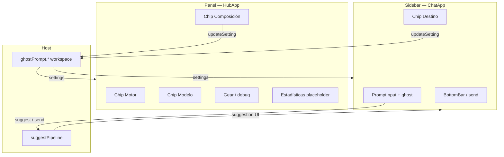

# FW–GB — Superficies dual: chat (sidebar) + hub (panel) (v0.6.2)

> **Objetivo:** Separar **funcionalmente** las dos vistas webview: el **sidebar** (`ghostPrompt.input`) concentra el **chat** (prompt, pre-suggestions, envío) y chips **esenciales** (destino); el **panel inferior** (`ghostPrompt.inputPanel`) pasa a ser **hub** de ajustes (motor, modelo, longitud, debug) y futuras **estadísticas**, sin duplicar el compositor de chat.
>
> **Versión objetivo:** `0.6.2` (`package.json`).
>
> **Fuera de alcance (este plan):** Nuevos motores LM, rediseño completo de estadísticas (solo shell/placeholder), extracción masiva de `engines/config/completionSources`, segundo bundle Vite (se mantiene un artefacto con enrutado por `viewId`).

**Relación con otros planes v0.6.2:**

| Plan | Foco |
| ---- | ---- |
| [01-consolidation-boundary-webview.md](./01-consolidation-boundary-webview.md) | Contratos host ↔ webview |
| [02-chat-webview-presuggestions.md](./02-chat-webview-presuggestions.md) | Pre-suggestions, overlay, capturas (FF–FH) |
| [03-runtime-config-pipeline.md](./03-runtime-config-pipeline.md) | Config canónica + `system/runtime/` |
| [04-suggestion-length-slider.md](./04-suggestion-length-slider.md) | `maxSuggestionChars`, slider, migración legacy |
| **05 (este doc)** | Superficies chat vs hub; fin paridad dual chat |

**Prerrequisitos:**

1. Plan 04 (FQ–FU) en `src/` — slider y pipeline por `maxSuggestionChars`.
2. **Operativo:** commit y push de cambios pendientes en la rama (fix slider, limpieza `GhostToolbarComposicionPanel`, etc.) **antes** de iniciar **FW**.

---

## Decisión de producto (acordada)

**Opción 2 — Sidebar con chips esenciales; hub con el resto + estadísticas.**

| Superficie | Contenedor VS Code | View ID | Contenido |
| ---------- | ----------------- | ------- | --------- |
| **Chat** | Activity Bar `ghostPrompt` | `ghostPrompt.input` | `PromptInput` + overlay ghost, `BottomBar` (enviar), chip **Destino** (y estado mínimo si hace falta). **Suggest / accept** solo aquí. |
| **Hub** | Panel inferior `ghostPromptPanel` | `ghostPrompt.inputPanel` | Chips **Motor**, **Modelo**, **Composición** (slider + atajos), **Ajustes** (gear/debug). Sección **Estadísticas** (placeholder). **Sin** textarea de chat. |

**Estado consistente en toda la app:** cualquier `updateSetting` (desde chat o hub) persiste en `ghostPrompt.*` vía `system/internals/config/write/`; `onDidChangeConfiguration` + `refreshSettingsAllViews` reenvían `settings` a **ambas** webviews. El pipeline suggest lee siempre workspace en el host (`getGhostPromptMaxSuggestionChars()`, etc.).



---

## Diagnóstico (estado actual)

| Área | Hallazgo | Archivos principales |
| ---- | -------- | -------------------- |
| Paridad forzada | Mismo `App.tsx` en ambas vistas; misma toolbar completa | `App.tsx`, `GhostToolbar.tsx` |
| Dual chat | `draftSync` entre vistas; `broadcastUi` con `broadcast: true` a ambas | `multiViewDraft.ts`, `MiniInputViewProvider.ts`, `inboundHandlers.ts` |
| Identificación vista | `window.__ghostPromptViewId` inyectado en HTML | `webviewHtml.ts` |
| Bundle | Un solo entry Vite → `dist/react/` | `vite.config.ts`, `main.tsx` |
| Docs desalineados | `ui/README.md` exige paridad funcional total | `src/ui/README.md` |
| Slider → chat | Tras commit, pipeline usa workspace; solo la superficie **chat** debe disparar `suggest` | `suggestPipeline.ts`, `useGhostPromptDerived.ts` |

**No se elimina** el panel inferior: cambia de “segundo chat” a **hub de control**.

---

## Arquitectura objetivo

### Un bundle, dos árboles React

```text
ui/webview/react/
├── main.tsx                    # router: viewId → ChatApp | HubApp
├── surfaces/
│   ├── chat/
│   │   ├── ChatApp.tsx
│   │   └── useChatSurface.ts   # text, suggestion, send, destino
│   └── hub/
│       ├── HubApp.tsx
│       └── useHubSurface.ts    # settings, provider status, sin suggest
├── features/
│   └── settings/               # handlers updateSetting compartidos (opcional)
├── components/                 # PromptInput, GhostToolbar*, BottomBar (reuso)
└── hooks/
    └── useGhostPromptShared.ts # config loaded, postMessage, settings inbound
```

**Fase posterior (opcional):** `React.lazy` para `HubApp` y reducir JS cargado en sidebar.

### Host: rol explícito

| Rol | Provider | Registra suggest | Recibe `suggestion` / `loading` | Envía `draftChanged` |
| --- | -------- | ---------------- | ------------------------------- | -------------------- |
| `chat` | `ghostPrompt.input` | Sí | Sí | Sí |
| `hub` | `ghostPrompt.inputPanel` | No | No (solo `settings`, status proveedores si aplica) | No |

Implementación sugerida v1: `MiniInputViewProvider` con `role: 'chat' | 'hub'` en constructor; v2 (opcional): `GhostPromptWebviewProviderBase` + dos clases.

### Protocolo

| Mensaje | Chat | Hub |
| ------- | ---- | --- |
| `updateSetting` | Sí (destino) | Sí (motor, modelo, longitud, …) |
| `suggest`, `accept`, `send` | Sí | **No** (webview no emite) |
| `draftChanged` | Sí | No |
| `draftSync` | **Eliminar** (era sync entre dos chats) | — |
| Inbound `settings` | Sí | Sí |
| Inbound `suggestion`, `loading`, … | Sí | **No** (host no postea al hub) |

Documentar matriz en `api/boundary/README` o cabecera de `zschemWebviewMessages.ts`.

---

## Estado del plan (marcar al avanzar)

| Fase | Tema | Estado |
| ---- | ---- | ------ |
| **FW** | Estructura surfaces + router + reparto chips (opción 2) | Completado |
| **FX** | Host: rol chat/hub, suggest y broadcast solo chat | Completado |
| **FY** | Limpieza dual-view (`draftSync`, `originViewId`, tests paridad) | Completado |
| **FZ** | Manifest: nombres de vistas, comando opcional “Abrir hub” | Completado |
| **GA** | Tests superficies + docs (`ui/README`, ARCHITECTURE) | Planificado |
| **GB** | QA manual + CHANGELOG; migraciones canónicas acotadas (opcional) | Planificado |

---

## Fase FW — Superficies React y chips (opción 2)

> **Motivo:** Separar UI sin tocar aún el host; permite revisar layout en ambas vistas.

| # | Tarea | Archivo / acción |
| - | ----- | ---------------- |
| W1 | `main.tsx`: enrutar por `window.__ghostPromptViewId` | `main.tsx` |
| W2 | `ChatApp`: `PromptInput`, `BottomBar`, chip **Destino** (extraer `GhostToolbarDestinoPanel` o toolbar reducido `ChatToolbar`) | `surfaces/chat/ChatApp.tsx` |
| W3 | `HubApp`: `GhostToolbar` sin destino (Motor, Modelo, Composición, Gear); placeholder estadísticas | `surfaces/hub/HubApp.tsx` |
| W4 | `useGhostPromptShared` + `useChatSurface` / `useHubSurface` | `hooks/`, `surfaces/*/` |
| W5 | Mantener `compact` vía capabilities si se activa en sidebar | `webviewHtml.ts` / `webviewCapabilitiesPayload` |
| W6 | Test smoke: chat monta `#prompt-input`; hub monta `data-key=maxSuggestionChars` y **no** `#prompt-input` | `webviewSurfaces.test.ts` (nuevo) |

**Criterio de hecho:** `npm run check` verde; en Extension Development Host se ven UIs distintas (aunque el host aún permita suggest desde hub hasta **FX**).

---

## Fase FX — Host: suggest y mensajes solo en chat

| # | Tarea | Archivo / acción |
| - | ----- | ---------------- |
| X1 | `MiniInputViewProvider`: `role: 'chat' \| 'hub'`; solo `chat` registra `ghostPromptSuggestDeps` | `MiniInputViewProvider.ts`, `extension.ts` |
| X2 | `inboundHandlers`: ignorar o rechazar `suggest`/`draftChanged` si origen es hub | `inboundHandlers.ts` |
| X3 | `broadcastUi` / `broadcastClearAll`: suggestion y loading solo a instancia **chat** | `MiniInputViewProvider.ts` |
| X4 | Hub sigue en `refreshSettingsAllViews` y `postSettings` | `settingsPostMessage.ts` |
| X5 | Tests: suggest desde hub no llama pipeline; desde chat sí | `ghostPromptWebviewInboundHandlers.test.ts`, `MiniInputViewProvider.test.ts` |

**Criterio de hecho:** Escribir en hub no dispara LM; cambiar slider en hub + commit → siguiente suggest en **sidebar** usa nuevo `maxSuggestionChars`.

---

## Fase FY — Eliminar plumbing dual-view de chat

> **Motivo:** Plan 02 (FG) resolvió carreras entre **dos chats**; al quedar un solo chat, sobra complejidad.

| # | Tarea | Archivo / acción |
| - | ----- | ---------------- |
| Y1 | Eliminar `broadcastDraftToPeers` y mensaje `draftSync` | `multiViewDraft.ts`, `inboundHandlers.ts`, `zschemWebviewMessages.ts` |
| Y2 | Quitar `originViewId` de `draftChanged` (o dejar solo para logs) | schemas + handlers |
| Y3 | React: quitar `skipSuggestionOnDraftSync`, `isDraftSyncForAnotherView`, `applyRemoteDraftRelay` | `handleGhostPromptInboundMessage.ts`, `useGhostPromptEffects.ts` |
| Y4 | Mantener `draftHydrate` al reabrir **sidebar** (borrador en host) | `multiViewDraft.ts` o renombrar a `chatDraft.ts` |
| Y5 | Sustituir `webviewToolbarParity.test.ts` por tests de **superficies distintas** | `webviewSurfaces.test.ts` |
| Y6 | Actualizar fixtures outbound sin `draftSync` | `webviewOutboundMessageFixtures.ts` |

**Criterio de hecho:** `rg draftSync` en `src/` → sin resultados (salvo comentarios/CHANGELOG).

---

## Fase FZ — Manifest y descubribilidad

| # | Tarea | Archivo / acción |
| - | ----- | ---------------- |
| Z1 | Renombrar vista panel: p. ej. **「GhostPrompt — Ajustes」** | `package.json` |
| Z2 | Sidebar: mantener **「GhostPrompt」** como chat | `package.json` |
| Z3 | Comando opcional: `ghostPrompt.openHub` → focus `ghostPrompt.inputPanel` | `package.json`, `extension.ts` |
| Z4 | CHANGELOG: usuarios con chat en panel deben usar sidebar | `CHANGELOG.md` |

**Criterio de hecho:** Paleta de vistas refleja chat vs ajustes.

---

## Fase GA — Documentación y tests

| # | Tarea | Archivo / acción |
| - | ----- | ---------------- |
| A1 | Reescribir `src/ui/README.md` (superficies, no paridad dual chat) | `ui/README.md` |
| A2 | Entrada en `Docs/ARCHITECTURE.md` o `Owners.md` si aplica | docs |
| A3 | Roadmap v0.6.2 README: filas FW–GB | `v0.6.2/README.md` |
| A4 | Anotar plan 02 FG: dual-view **histórico** post-FY | `02-chat-webview-presuggestions.md` |
| A5 | Corregir doc: ID en `__ghostPromptViewId`, no solo capabilities | `ui/README.md` |

**Criterio de hecho:** Ningún doc exige “misma UX de chat en panel”.

---

## Fase GB — Verificación y migraciones canónicas (opcional)

### Checklist QA manual

1. Sidebar: escribir → ghost suggestion → Tab accept → enviar al destino configurado.
2. Hub: mover slider longitud → soltar (commit) → sidebar: nuevo suggest respeta longitud.
3. Hub: cambiar motor/modelo → sidebar recibe `settings` (modelo/estado coherente).
4. Hub: no muestra textarea ni ghost overlay.
5. Reabrir sidebar: borrador restaurado si aplica.
6. VSOpenCodeX / Cursor / Copilot sin regresión en envío.
7. Canal **GhostPrompt Log** sin errores de mensajes rechazados desde hub.

### Migraciones canónicas (PR separado recomendado)

| Prioridad | Tarea | Ruta objetivo |
| --------- | ----- | ------------- |
| P1 | Mover registro providers | `engines/runtime/providerStatusRegistry.ts` → `system/runtime/providers/` |
| P1 | Tests config | `workspaceConfigGetters.test.ts`, `migrateGhostPromptSuggestionLength.test.ts` |
| P0 | README `system/` (quitar `policies/` inexistente) | `system/README.md` |

**Criterio de hecho:** `npm run check`; checklist QA firmado en este doc o en bitácora del PR.

---

## Código a eliminar (resumen)

| Elemento | Tras fase |
| -------- | --------- |
| Paridad “dos chats” en `App.tsx` único | FW |
| `draftSync`, `broadcastDraftToPeers` | FY |
| `originViewId` en draft (si solo era dual-view) | FY |
| Tests `webviewToolbarParity` “misma UX panel” | FY → `webviewSurfaces` |
| Segunda toolbar completa en sidebar | FW |
| `broadcast: true` a hub para suggestion | FX |

**Conservar:** un bundle, schemas en `protocols/`, `applyWebviewUpdateSetting`, overlay ghost (plan 02), migración `migrateGhostPromptSuggestionLength`.

---

## Orden de PRs sugerido

| PR | Fases | Notas |
| -- | ----- | ----- |
| 1 | **FW** | Solo React; host aún permisivo |
| 2 | **FX** + **FY** | Host + limpieza protocolo |
| 3 | **FZ** + **GA** | Manifest + docs + tests |
| 4 | **GB** (opcional) | QA + migraciones `system/` |

---

## Riesgos

| Riesgo | Mitigación |
| ------ | ---------- |
| Usuario usaba chat solo en panel | CHANGELOG + comando abrir hub/chat |
| Hub cambia setting y sidebar desincronizado | Mantener broadcast `settings` a ambas instancias |
| Regresión pre-suggestions | Tests FF–FH siguen válidos en **ChatApp** |
| Bundle grande en hub | Lazy-load hub (post-GB) |

---

## Verificación habitual (cada fase)

1. `npm run check`
2. Extension Development Host: sidebar + panel abiertos; validar criterios de la fase
3. Si toca protocolo: actualizar fixtures y tests boundary
