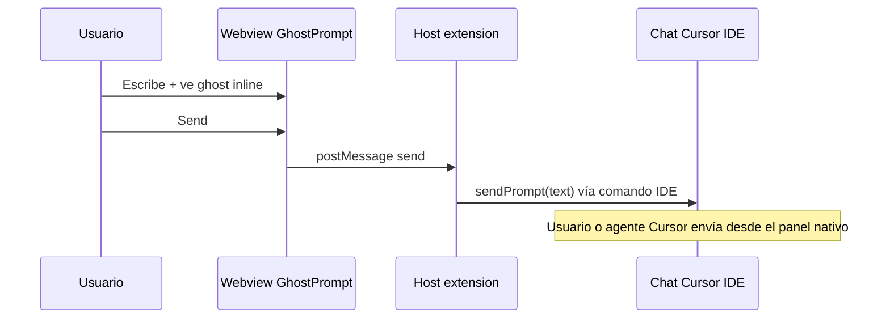

# Roadmap v0.6 — Destino Cursor Chat (Send al chat nativo del IDE)

> **Versión objetivo:** minor posterior a **0.6.0** (p. ej. **0.6.1** o **0.7.0**), según alcance y QA en Cursor Desktop.  
> **Alcance:** añadir **`cursorChat`** como destino de agente — **no** sustituye motor ni webview GhostPrompt.  
> **Fuera de alcance v1:** [Cursor Cloud Agents API](https://cursor.com/docs/api) (HTTP, API keys, agentes en la nube). Eso sería un destino distinto si se prioriza más adelante.

**Matriz de producto:** situación nueva — _cualquier motor_ · _destino Cursor_ · _superficie GhostPrompt_ (igual que Copilot Chat). Ver [`GhostPrompt-motor-destino-matrix.md`](../../../../Integrations/GhostPrompt-motor-destino-matrix.md).

**Doc técnica IDE (comandos):** [`Docs/Integrations/APIS/Cursor.md`](../../../../Integrations/APIS/Cursor.md) — separar **IDE / extension API** vs **API HTTP**.

**Metodología:** fases en orden; marcar checkboxes al cerrar. Actualizar la **bitácora** al final de cada sesión de trabajo.

---

## Resumen del flujo deseado



Comportamiento análogo a `copilotChat`:

```10:12:src/destinations/copilotChat/copilotChatDestination.ts
async function sendToChat(query: string): Promise<void> {
  await vscode.commands.executeCommand('workbench.action.chat.open', { query });
}
```

El destino Cursor debe implementar el mismo contrato `DestinationProvider.sendPrompt` en [`destinationRegistry.ts`](../../../../../src/destinations/destinationRegistry.ts).

---

## Fase 0 — Descubrimiento en Cursor Desktop

### Objetivo

Identificar el **comando estable** (y argumentos) para abrir el chat de Cursor con el texto del prompt, o rellenar el input del panel Agent/Composer.

### Pasos derivados

- [x] En Cursor: paleta de comandos → buscar `chat`, `composer`, `agent`, `aichat`, `cursor` (o F1 → **GhostPrompt: Discover Cursor Chat Commands**).
- [x] `vscode.commands.getCommands(true)` filtrado vía `filterCursorChatCandidateCommands` en `cursorChatCommands.ts`.
- [x] Candidatos probados en código v1:
  - [x] `workbench.action.chat.open` + `{ query: text }` (**primario**)
  - [x] `workbench.action.chat.open` + `string` (**fallback** si falla el objeto)
  - [ ] Comandos propios Composer/Agent — listados en descubrimiento; **no** usados en v1 sin QA E2E
- [x] Documentado en [`Cursor.md`](../../../../Integrations/APIS/Cursor.md): `commandId`, argumentos, solo rellena (no auto-send), descartados.
- [x] Fallback host incorrecto: error en Send + `cursorDesktopHost` para ocultar en UI (fase C).

### Criterio de hecho

- Comando principal documentado y reproducible manualmente desde una extensión mínima en Cursor.
- Lista de comandos descartados / alternativas en `Cursor.md`.

### Estado

- [x] Descubrimiento cerrado (v1: `workbench.action.chat.open`)

---

## Fase A — Diseño y contrato en código

### Objetivo

Fijar ID de destino, reglas de convivencia con `copilotChat` y `vsOpenCodeX`, y criterios de error.

### Pasos derivados

- [x] ID final: `cursorChat` (enum en `package.json`, `DestinationId`, schemas Zod, tipos webview).
- [x] Confirmar: con destino Cursor **no** se aplica gating VSX (webview inline + Send siguen activos; solo `vsOpenCodeX` bloquea suggest/send).
- [x] Confirmar: `handleGhostPromptInboundSend` usa `getActiveDestinationProvider().sendPrompt` sin ramas especiales salvo las ya existentes para `vsOpenCodeX`.
- [x] Política si el comando falla: `showErrorMessage` como en send actual; log módulo `destinations` / `cursor` (fase B al registrar proveedor).
- [x] Detección host: `isCursorDesktopHost()` + flag `cursorDesktopHost` en mensaje `settings` (UI dropdown en fase C).

### Criterio de hecho

- Decisión registrada en este doc (tabla abajo) y en `Cursor.md`.

### Estado

- [x] Diseño cerrado

| Decisión                | Propuesta v1                                      |
| ----------------------- | ------------------------------------------------- |
| ID destino              | `cursorChat`                                      |
| Superficie              | Webview GhostPrompt completa (como `copilotChat`) |
| API HTTP Cursor         | Fuera de v1                                       |
| Auto-send tras inyectar | No (solo abrir/rellenar; usuario envía)           |
| Gating VSX              | Solo `vsOpenCodeX`                                |
| Host detection          | `cursorDesktopHost` en settings al webview        |

**Código (fase A):** `src/destinations/cursor/cursorHost.ts`, `parseGhostPromptAgentDestination` / `DestinationId` en `destinationRegistry.ts`, schemas en `webviewMessageSchemas.ts`, tests `tests/destinations/cursorHost.test.ts` + ampliación `destinationRegistry` / `applyWebviewUpdateSetting`.

---

## Fase B — Implementación `destinations/cursor`

### Objetivo

Registrar proveedor y `sendPrompt` que ejecute el comando validado en Fase 0.

### Pasos derivados

- [x] Crear `src/destinations/cursor/cursorChatDestination.ts`.
- [x] `registerDestination({ id, sendPrompt })` → `executeCursorChatOpen`.
- [x] Import side-effect en `src/extension/extension.ts` (junto a `copilotChat`).
- [x] `DestinationId` / `parseGhostPromptAgentDestination` (fase A).
- [x] `getGhostPromptAgentDestination()` mapea `cursorChat` (fase A).

### Criterio de hecho

- Send desde webview con destino Cursor abre/rellena el chat en Cursor (manual QA Fase F).
- Sin regresión en destinos `copilotChat` y `vsOpenCodeX`.

### Estado

- [x] Implementación cerrada (QA manual en fase F)

---

## Fase C — Configuración, protocolos y UI

### Objetivo

Exponer el destino en settings y en el dropdown **Destino** del webview.

### Pasos derivados

- [x] `package.json`: `ghostPrompt.agentDestination` enum incluye `cursorChat`; descripción markdown.
- [x] `src/ui/webview/react/types.ts`: `AgentDestination` + `cursorDesktopHost` en settings (dropdown en fase C).
- [ ] Toolbar / selector destino: etiqueta legible («Cursor Chat» / «Cursor»); mostrar solo si `cursorDesktopHost`.
- [x] `settingsPostMessage`: propagar `agentDestination` efectivo y `cursorDesktopHost`.
- [ ] README / matriz motor-destino: fila _Motor X · Destino Cursor_.

### Criterio de hecho

- Cambiar destino en UI persiste en settings y el siguiente Send usa el proveedor Cursor.

### Estado

- [ ] Configuración y UI cerradas

---

## Fase D — Tests automatizados

### Objetivo

Cobertura unitaria del registro y del send sin depender de Cursor real en CI.

### Pasos derivados

- [ ] `tests/destinationRegistry.test.ts`: nuevo id registrado; `getActiveDestinationProvider` con setting mockeado.
- [ ] Test de `cursorChatDestination`: mock `vscode.commands.executeCommand` con argumentos esperados.
- [ ] `tests/.../inboundHandlers` o equivalente: send con destino `cursorChat` invoca el proveedor correcto.
- [ ] `npm run check` verde.

### Criterio de hecho

- Tests nuevos en verde; sin flakes por timing de migración/logging.

### Estado

- [ ] Tests cerrados

---

## Fase E — Documentación de producto

### Objetivo

Usuarios y mantenedores entienden cuándo usar destino Cursor vs Copilot vs VSX.

### Pasos derivados

- [x] Completar [`Cursor.md`](../../../../Integrations/APIS/Cursor.md): sección **Destino GhostPrompt** + sección **API HTTP** (referencia, no requisito v1).
- [ ] `Docs/Integrations/GhostPrompt-motor-destino-matrix.md`: situación Cursor.
- [ ] `CHANGELOG.md` entrada bajo versión de release.
- [ ] `Docs/Owners.md` / `ARCHITECTURE.md`: una línea en § destinations si procede.

### Criterio de hecho

- Docs sin contradecir comportamiento; enlace desde este roadmap.

### Estado

- [ ] Documentación cerrada

---

## Fase F — QA manual y release

### Objetivo

Validar E2E en **Cursor Desktop** con GhostPrompt instalado (VSIX o F5).

### Checklist QA

- [ ] Motor Copilot + destino Cursor: suggest inline en GP → Send → texto en chat Cursor.
- [ ] Motor OpenCode + destino Cursor: mismo flujo (motor independiente del destino).
- [ ] Destino `copilotChat` en VS Code: sin regresión.
- [ ] Destino `vsOpenCodeX`: sin regresión (Send GP sigue deshabilitado).
- [ ] Texto largo / multilínea / caracteres especiales.
- [ ] Error controlado si comando no existe (host incorrecto).

### Release

- [ ] Versión y `CHANGELOG` publicados.
- [ ] VSIX de prueba en Cursor.

### Estado

- [ ] QA manual cerrada
- [ ] Release cerrado

---

## Mejoras posteriores (backlog, sin fase obligatoria)

- [ ] Auto-envío tras inyectar (si Cursor expone comando estable).
- [ ] Elegir panel Chat vs Composer vs Agent explícitamente.
- [ ] Destino alternativo vía **Cloud Agents API** (diseño distinto; API key, red, cuotas).
- [ ] Optimizar foco / no robar foco del webview GhostPrompt.

---

## Bitácora global

| Fecha      | Fase | Nota                                                                                                                                                                         |
| ---------- | ---- | ---------------------------------------------------------------------------------------------------------------------------------------------------------------------------- |
| 2026-05-15 | —    | Roadmap creado en `v0.6/Destinations/`; alcance = Send al chat IDE Cursor, patrón `copilotChat`.                                                                             |
| 2026-05-15 | A    | Contrato `cursorChat`: `destinationRegistry`, Zod, `package.json`, `cursorHost.ts`, `settingsPostMessage`, `Cursor.md`; enlaces del roadmap corregidos; tests host/registry. |
| 2026-05-15 | 0    | Comando v1 `workbench.action.chat.open` + `{ query }` / fallback string; `ghostPrompt.discoverCursorChatCommands`; `Cursor.md` tabla fase 0.                                 |
| 2026-05-15 | B    | `cursorChatDestination.ts`, `cursorChatCommands.ts`, registro en `extension.ts`; tests `cursorChatDestination` / `cursorChatCommands`.                                       |
|            | C    |                                                                                                                                                                              |
|            | D    |                                                                                                                                                                              |
|            | E    |                                                                                                                                                                              |
|            | F    |                                                                                                                                                                              |

---

## Referencias

- [`GhostPrompt-motor-destino-matrix.md`](../../../../Integrations/GhostPrompt-motor-destino-matrix.md)
- [`Docs/Integrations/APIS/Cursor.md`](../../../../Integrations/APIS/Cursor.md)
- [`v0.5/destinations/1.coexistence.md`](../../../v0.5/destinations/1.coexistence.md) (patrón de fases y checkboxes)
- [`01-core-domain-reorganization.md`](../01-core-domain-reorganization.md) (capa `destinations`)
- Código: [`destinationRegistry.ts`](../../../../../src/destinations/destinationRegistry.ts), [`copilotChatDestination.ts`](../../../../../src/destinations/copilotChat/copilotChatDestination.ts), [`inboundHandlers.ts`](../../../../../src/api/protocols/inboundHandlers.ts)
