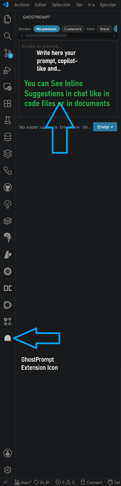
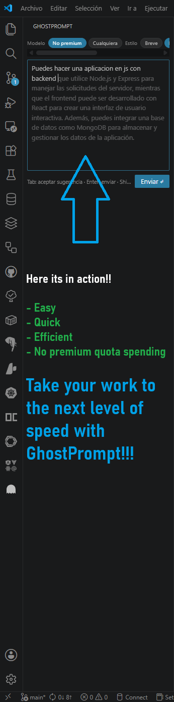
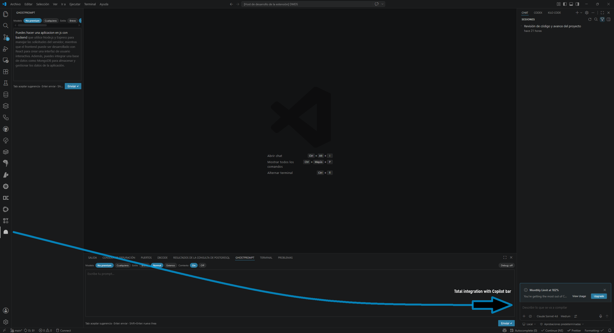
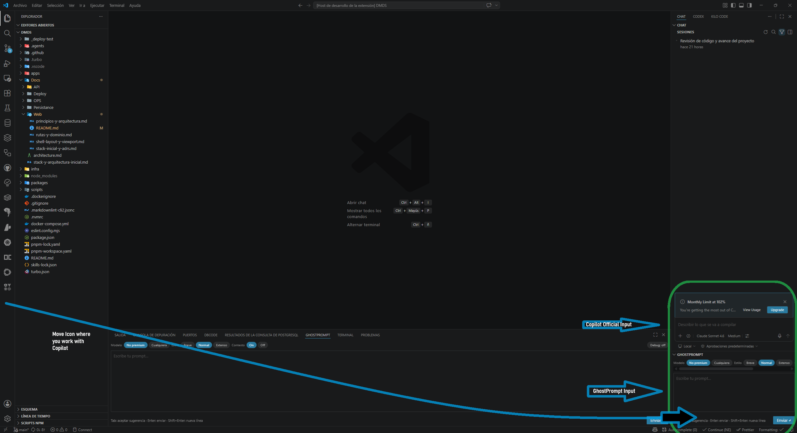

# GhostPrompt

> Ghost-text completions for your Copilot prompts — write faster, think clearer.

<!-- markdownlint-disable-next-line MD036 -->
**Version 0.2.0**

---

## Why GhostPrompt

Writing prompts in Copilot Chat is often repetitive and context-switch heavy.  
**GhostPrompt** gives you an inline mini-composer inside VS Code with ghost-text suggestions, so you can draft faster and send to Copilot Chat without breaking flow.

### Benefits at a glance

- Faster prompt drafting with inline continuation suggestions
- Safer usage controls (non-premium policy, request governor)
- Better writing flow with keyboard-first interactions (`Tab`, `Enter`)
- Compact controls directly inside the composer (policy/style/context/debug)

## Preview

Screenshots are **collapsed by default** so the README stays scannable; click a title to expand. Display size uses a fixed width in markup—you can replace the PNG files with your own scaled exports without editing paths.

<!-- markdownlint-disable MD033 -->

<strong>1 · Icon and inline composer</strong>

<strong>2 · Inline continuation in action</strong>

<strong>3 · Next to Copilot Chat</strong>

<strong>4 · Quick controls (model, style, context)</strong>

<!-- markdownlint-enable MD033 -->

---

## Key features

- **Inline ghost-text completions** — suggestions appear as continuation of your current text. Press `Tab` to accept.
- **Always visible** — the input lives in the Activity Bar sidebar *and* the bottom Panel; pick whichever fits your layout.
- **One-key send** — `Enter` sends your prompt to Copilot Chat. `Shift+Enter` adds a newline.
- **Request safety controls** — dedupe, cache, cooldown, rate-limit, and session budget to prevent over-calling.
- **Model policy controls** — force non-premium models by default, with optional override.
- **Non-intrusive** — completions run via `vscode.lm`; no draft editor tabs, no focus stealing.
- **Private logs** — accepted suggestions and sent prompts are saved in the extension's private storage (not inside your project).

---

## Requirements

- VS Code **1.90** or later
- [GitHub Copilot](https://marketplace.visualstudio.com/items?itemName=GitHub.copilot) extension installed and signed in

---

## Quick start (30 seconds)

1. Open the **GhostPrompt** panel from the Activity Bar (chat-bubble icon) or from the bottom Panel tabs.
2. Start typing your prompt — after a short pause, a ghost-text continuation appears inline.
3. Press `Tab` to accept the suggestion and append it to your prompt.
4. Press `Enter` to send the final prompt to **Copilot Chat**.

*Screenshots: expand **2 · Inline continuation** in [Preview](#preview) above.*

### Integrated with Copilot

You can keep GhostPrompt near Copilot Chat and move quickly between drafting and sending prompts.

*See **3 · Next to Copilot Chat** in [Preview](#preview).*

---

## Keyboard shortcuts

| Key           | Action                                   |
| ------------- | ---------------------------------------- |
| `Tab`         | Accept the current ghost-text suggestion |
| `Enter`       | Send prompt to Copilot Chat              |
| `Shift+Enter` | Insert a newline in the prompt           |

---

## Settings

### Model policy

- `ghostPrompt.suggestionModelPolicy = nonPremiumOnly` (default): only non-premium-like models are allowed.
- `ghostPrompt.suggestionModelPolicy = anyModel`: uses the first available model (may consume premium quota).

### Suggestion quality

- `ghostPrompt.maxSuggestionChars` (default `180`)
- `ghostPrompt.suggestionStyle` (`concise` | `balanced` | `detailed`, default `balanced`)
- `ghostPrompt.contextMode` (`off` | `basic`, default `basic`)

### Request governor (cost/frequency protection)

- `ghostPrompt.minCharsForSuggestion` (default `6`)
- `ghostPrompt.requestCooldownMs` (default `700`)
- `ghostPrompt.cacheTtlMs` (default `45000`)
- `ghostPrompt.rateLimitMaxRequests` (default `40`)
- `ghostPrompt.rateLimitWindowMs` (default `600000`)
- `ghostPrompt.sessionRequestBudget` (default `120`)

### Debug mode

- Run command: `GhostPrompt: Toggle Debug`
- Output channel: `GhostPrompt Suggestions`
- Setting: `ghostPrompt.debugSuggestions`

Inside the webview mini-input, you can also change policy, style, context, and debug from the **control strip** (chips at the top). See **4 · Quick controls** in [Preview](#preview).

## Roadmap

v0.2 is **shipped**; the milestone log is archived in [`Docs/Roadmap-v0.2.md`](./Docs/Roadmap-v0.2.md).

---

## Release notes

### 0.2.0

- **Inline ghost-text** in the composer, including scroll/height behavior for long suggestions.
- **Suggestion pipeline**: typed results (`suggestion`, `empty`, `error`, `loading`), no silent failures.
- **Request governor** (dedupe, cache, cooldown, rate limit, session budget) to limit accidental over-calling.
- **Model policy**: default **non-premium** selection with optional `anyModel` override; commands and settings for policy/debug.
- **Quality controls**: suggestion style (`concise` / `balanced` / `detailed`), `maxSuggestionChars`, optional **session context** (`contextMode`).
- **Webview UX**: compact chip controls, keyboard/a11y polish, layout fixes for narrow Activity Bar views.
- **Tests**: Vitest suite (`npm run test` / `npm run check`).
- **Docs**: debug flow guide, README screenshots (collapsible), repository metadata for marketplace.

### 0.0.1

Initial release: dual-panel registration (Activity Bar + bottom Panel), ghost-text completions via `vscode.lm`, Tab-to-accept, Enter-to-send.

---

## License

MIT
