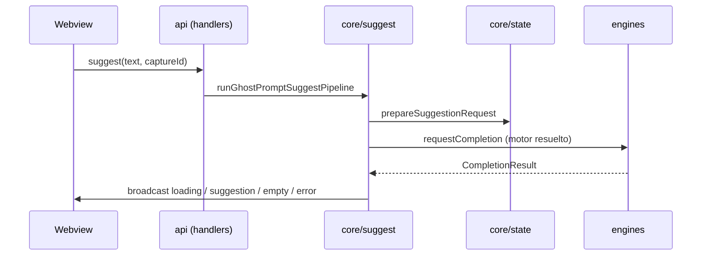

# `core/` — Dominio de suggestions

> Valor central del producto: **cómo se pide, correlaciona, cancela y entrega** una suggestion, más contratos compartidos con los motores. No infra genérica de VS Code ni composición de listas solo para chips de UI.

**Roadmap de reorganización:** [`Docs/Plans/Roadmaps/v0.6/01-core-domain-reorganization.md`](../../Docs/Plans/Roadmaps/v0.6/01-core-domain-reorganization.md)  
**Ownership global:** [`Docs/Owners.md`](../../Docs/Owners.md)

---

## Qué sí entra en `core/`

- Tipos y resultados de completion (`types.ts` → `contracts/completion.ts`).
- Instrucción y post-proceso del texto devuelto (`prompt/instruction.ts`, `prompt/normalize.ts`) — en v0.6 se pretende **adelgazar** heurísticas; ver roadmap fase E.
- Streaming de texto LM (`streaming/collect.ts` + barrel `streaming/index.ts`), idioma de suggestion (`language/index.ts`), fases de carga UI (`presentation/loading.ts`).
- Resolución de **fuentes** y routing a motor (`routing/sources.ts`).
- Estado compartido host del ciclo suggestion (`state/GhostPromptSessionStore.ts`).
- Orquestación del mensaje webview `suggest` (`suggest/`).
- Contexto bootstrap de proyecto (`memory/projectBootstrapContext.ts`) y memoria persistente (`memory/`) mientras sigan en el producto (decisión v0.6 fase D).
- `SuggestionRequestGovernor` (**legacy** en `system/policies/`; **no** en el hot path; **no** en el barrel `index.ts`).

## Qué no debe vivir aquí

- **Lista unificada multi-motor para el selector** → `engines/catalog/mergedModelCatalog.ts` (`listMergedSuggestionModels`).
- Integración VS Code de vistas/HTML/CSP → `ui/provider/`.
- Protocolos Zod webview ↔ host → `api/`.
- **El barrel `index.ts` no reexporta** catálogos ni registry de `engines/` — importar desde `engines/...` según capa.

---

## Estructura actual

```
core/
├── types.ts                    # barrel → contracts/completion.ts
├── contracts/
│   └── completion.ts
├── prompt/
│   ├── instruction.ts
│   ├── normalize.ts
│   └── index.ts
├── presentation/
│   ├── loading.ts
│   └── index.ts
├── streaming/
│   ├── collect.ts
│   └── index.ts
├── language/
│   └── index.ts
├── routing/
│   └── sources.ts
├── suggest/
│   ├── runSuggest.ts
│   └── index.ts
├── index.ts
├── state/
│   └── GhostPromptSessionStore.ts
└── memory/
    ├── projectBootstrapContext.ts
    └── …
```

Un **layout** más granular (p. ej. más módulos bajo `presentation/`) está descrito como objetivo en [`Docs/Plans/Roadmaps/v0.6/01-core-domain-reorganization.md`](../../Docs/Plans/Roadmaps/v0.6/01-core-domain-reorganization.md) (**Fase G**). Ya existen `routing/`, `contracts/`, `suggest/`, `prompt/`, `presentation/`, `streaming/`, `language/` y `state/`.

---

## Flujo del pipeline (`suggest`)



Pasos alineados con `runSuggest.ts`: preparar token y `captureId`, resolver fuente (`routing/sources` + registry), llamar al `CompletionProvider`, broadcast a la UI.

---

## Dependencias típicas

| Importa desde                             | Motivo                                    |
| ----------------------------------------- | ----------------------------------------- |
| `engines/engineRegistry`                  | Obtener el motor por `CompletionSourceId` |
| `system/debug/SuggestionDebug`            | Logging opcional de performance           |
| `ui/notifications/suggestionNotification` | Avisos host en vacío/error accionable     |
| `api/protocols/webviewProtocols`          | Tipo del mensaje inbound `suggest`        |

---

## Tests relevantes

| Test                                                            | Cubre                            |
| --------------------------------------------------------------- | -------------------------------- |
| `host/ghostPromptSuggestPipeline.test.ts`                       | Pipeline suggest con mocks       |
| `GhostPromptSessionStore.test.ts`                               | Estado, cancelación, captureId   |
| `CopilotCompletion.test.ts` / `opencodeLmEngine` tests          | Vía engines, contratos con core  |
| `instructionNormalizeContract.test.ts`                          | Contrato instruction ↔ normalize |
| `completionSources.test.ts`                                     | Routing de fuentes               |
| `loading.test.ts`                                               | Textos de fase                   |
| `projectBootstrapContext.test.ts`, `projectMemoryStore.test.ts` | Contexto / memoria si aplica     |

El merge de catálogos multi-motor se cubre en **`tests/mergedModelCatalog.test.ts`** (módulo bajo `engines/catalog/`).
