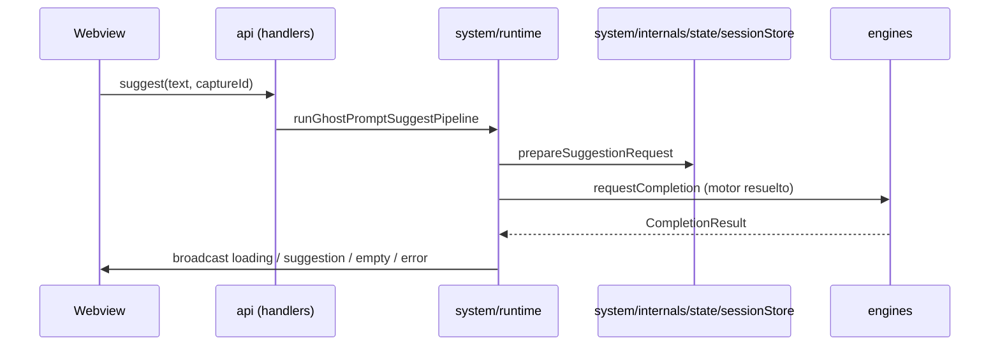

# `sugcore/` — Dominio de suggestions

> Valor central del producto: **cómo se pide, correlaciona, cancela y entrega** una suggestion, más contratos compartidos con los motores. No infra genérica de VS Code ni composición de listas solo para chips de UI.

**Roadmap de reorganización:** [`Docs/Plans/Roadmaps/v0.6/Restructure/01-slim-core.md`](../../Docs/Plans/Roadmaps/v0.6/Restructure/01-slim-core.md)  
**Ownership global:** [`Docs/Owners.md`](../../Docs/Owners.md)

---

## Qué sí entra en `sugcore/`

- Tipos y resultados de completion (`types.ts`).
- Reglas de construcción del prompt (`rules/instruction.ts`).
- Reglas de instrucción LM (`rules/instruction.ts`). La resolución de fuentes y routing a motor vive en `engines/config/completionSources.ts` y `engines/routing/resolveCompletionSource.ts`.

## Qué no debe vivir aquí

- **Lista unificada multi-motor para el selector** → `engines/catalog/mergedModelCatalog.ts` (`listMergedSuggestionModels`).
- Integración VS Code de vistas/HTML/CSP → `ui/provider/`.
- Protocolos Zod webview ↔ host → `api/`.
- **Estado interno** (session store, provider status) → `system/internals/state/`; contratos → `system/internals/protocols/state/`.
- **Runtime / orquestación** del pipeline suggest → `system/runtime/`.
- Stream LM Copilot, config de fuentes → `engines/copilot/`, `engines/config/`.

---

## Estructura actual

```text
sugcore/
├── rules/
│   └── instruction.ts          # buildCompletionInstruction
└── README.md
```

---

## Flujo del pipeline (`suggest`)



Pasos alineados con `system/runtime/suggestRuntime.ts`: preparar token y `captureId`, resolver fuente (`engines/config/completionSources` + `engines/routing/resolveCompletionSource` + registry), llamar al `CompletionProvider`, broadcast a la UI.

---

## Dependencias típicas

| Importa desde                             | Motivo                                    |
| ----------------------------------------- | ----------------------------------------- |
| `engines/engineRegistry`                  | Obtener el motor por `CompletionSourceId` |
| `system/internals/state/sessionStore`    | Session store (captureId, cancelación)    |
| `system/internals/protocols/state/loading` | Fases y textos de carga                  |
| `system/runtime`                          | Pipeline de orquestación suggest          |
| `system/log`                              | Logging opcional de performance           |
| `api/protocols/webviewProtocols`          | Tipo del mensaje inbound `suggest`        |

---

## Tests relevantes

| Test                                          | Cubre                            |
| --------------------------------------------- | -------------------------------- |
| `system/runtime/suggest.test.ts`              | Pipeline suggest con mocks       |
| `system/internals/state/sessionStore.test.ts` | Estado, cancelación, captureId   |
| `CopilotCompletion.test.ts` / `opencodeLmEngine` tests | Vía engines, contratos con sugcore |
| `engines/routing/resolveCompletionSource.test.ts` | Routing de fuentes           |
| `protocols/state/loading/loadingLabels.test.ts` | Textos por fase                |
| `engines/copilot/collectLmResponse.test.ts`   | Stream LM VS Code (Copilot)      |

El merge de catálogos multi-motor se cubre en **`tests/mergedModelCatalog.test.ts`** (módulo bajo `engines/catalog/`).
